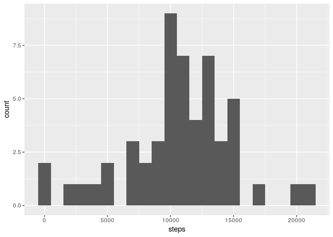
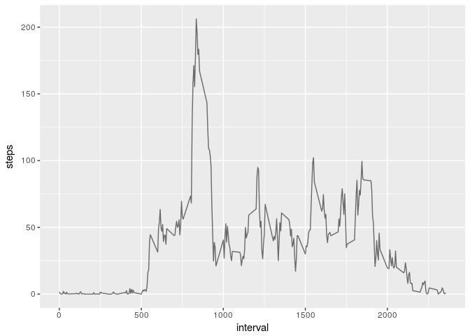
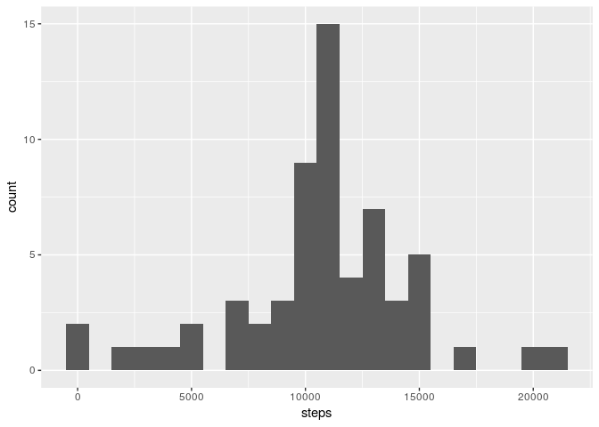
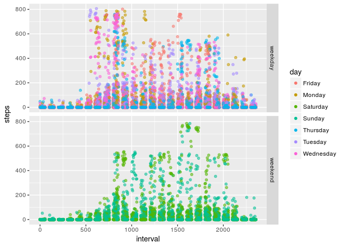
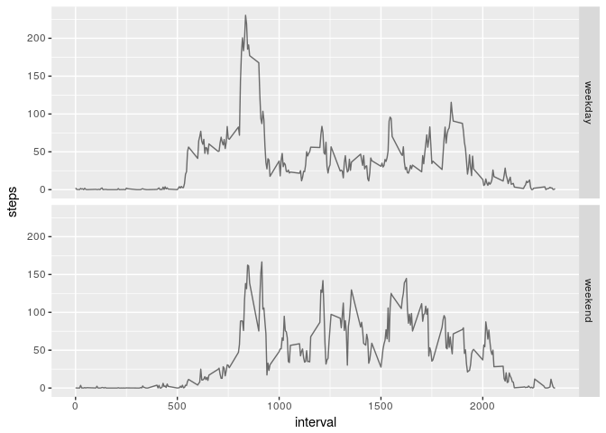

Steps:

1.    Code for reading in the dataset and/or processing the data
1.    Histogram of the total number of steps taken each day
1.    Mean and median number of steps taken each day
1.    Time series plot of the average number of steps taken
1.    The 5-minute interval that, on average, contains the maximum number of steps
1.    Code to describe and show a strategy for imputing missing data
1.    Histogram of the total number of steps taken each day after missing values are imputed
1.   Panel plot comparing the average number of steps taken per 5-minute interval across weekdays and weekends
1.   All of the R code needed to reproduce the results (numbers, plots, etc.) in the report


## Loading and preprocessing the data

### 1 - Code for reading in the dataset and/or processing the data: 

Loading the activities from the file. 

```r
unzip("./activity.zip")
activities <- read.csv("activity.csv")
```

Aggregate the steps per day for furthers analysis.

```r
step_per_day <- aggregate(steps ~ date, activities, sum)
head(step_per_day, 5)
```

```
##         date steps
## 1 2012-10-02   126
## 2 2012-10-03 11352
## 3 2012-10-04 12116
## 4 2012-10-05 13294
## 5 2012-10-06 15420
```

## What is mean total number of steps taken per day?

### 2 - Histogram of the total number of steps taken each day:
*We can the that the mean is arround 10 000 steps.*

```r
library(ggplot2)
qplot(data = step_per_day, x = steps, geom = "histogram", binwidth = 1000)
```

<!-- -->

### 3 - Mean and median number of steps taken each day:


```r
mean(step_per_day$steps)
```

```
## [1] 10766.19
```

```r
median(step_per_day$steps)
```

```
## [1] 10765
```

## What is the average daily activity pattern?

### 4 - Time series plot of the average number of steps taken:


```r
daily_patern <- aggregate(steps ~ interval, activities, mean, na.rm = TRUE)

max_interval <- daily_patern[which.max(daily_patern$steps),]

ggplot(daily_patern, aes(x = interval, y = steps)) + geom_line(aes(alpha = 0.7)) + scale_alpha(guide = 'none')
```

<!-- -->

### 5 - The 5-minute interval that, on average, contains the maximum number of steps:

```r
max_interval <-max_interval$interval
print(max_interval)
```

```
## [1] 835
```

*We can the that the interval with the maxium of steps is 835.*

## Imputing missing values
### 6 - Code to describe and show a strategy for imputing missing data:

The daily patern of each mean steps by interval will be used to fill the NAs.

In the original dataset we have the following numbers of NAs:

```r
sum(is.na(activities$steps))
```

```
## [1] 2304
```
Filling the NAs values : 

```r
missing_measures <- activities[is.na(activities$steps),]
for(i in 1:nrow(missing_measures)) {
    measure <- missing_measures[i,]
    missing_measures[i, "steps"] <- daily_patern[daily_patern$interval == measure$interval , "steps"]
}
activites_completed <-  rbind(missing_measures, activities[!is.na(activities$steps),])
```

After filling we have the following numbers of NAs:

```r
sum(is.na(activites_completed$steps))
```

```
## [1] 0
```

### 7 - Histogram of the total number of steps taken each day after missing values are imputed

```r
steps_per_day_completed <- aggregate(steps ~ date, activites_completed, sum)
qplot(data = steps_per_day_completed , x = steps, geom = "histogram",  binwidth = 1000)
```

<!-- -->

Mean of steps with a completed dataset:

```r
mean(steps_per_day_completed$steps)
```

```
## [1] 10766.19
```
Median of steps with a completed dataset:

```r
median(steps_per_day_completed$steps)
```

```
## [1] 10766.19
```


## Are there differences in activity patterns between weekdays and weekends?


```r
activites_completed$day <- weekdays(as.Date(activites_completed$date))
activites_completed$daytype <- "weekday" 
activites_completed[grepl(pattern = "Saturday|Sunday", activites_completed$day), "daytype"] <- "weekend"
activites_completed$daytype <- as.factor(activites_completed$daytype)

ggplot(activites_completed, aes(x = interval, y = steps)) + geom_point(aes(alpha = 0.2, col = day)) +  facet_grid(daytype ~ .) + scale_alpha(guide = 'none')
```

<!-- -->

#### 8  - Panel plot comparing the average number of steps taken per 5-minute interval across weekdays and weekends


```r
daily_patern_daytype <- aggregate(steps ~ interval + daytype, data = activites_completed, mean)

ggplot(daily_patern_daytype, aes(x = interval, y = steps)) + geom_line(aes(alpha = 0.2)) +  facet_grid(daytype ~ .) + scale_alpha(guide = 'none')
```

<!-- -->

*We can see that people are tend to walk later on the weekend.*

